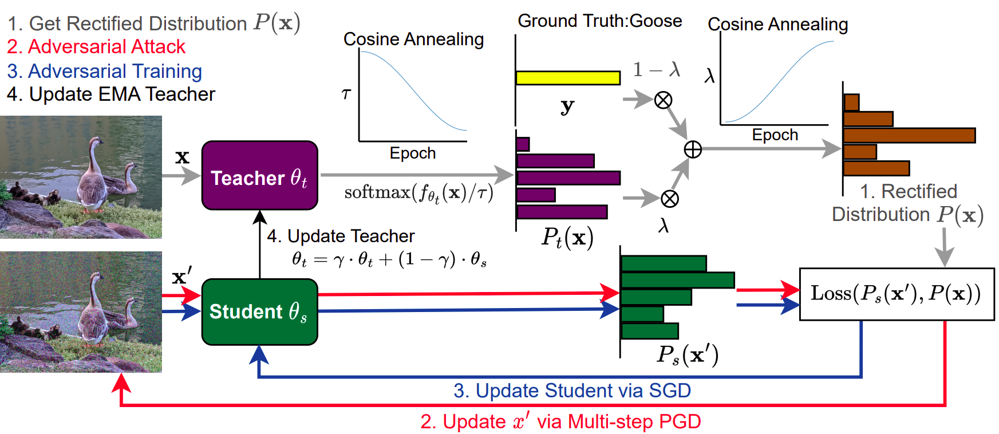

# Annealing Self-Distillation Rectification Improves Adversarial Training

This repository is the official implementation of ["Annealing Self-Distillation Rectification Improves Adversarial Training"](https://arxiv.org/abs/2305.12118) by Yu-Yu Wu, Hung-Jui Wang and Shang-Tse Chen (National Taiwan University). 




## Requirements

The code has been implemented and tested with `Python 3.9.14`
To install requirements:

```setup
pip install -r requirements.txt
```

## Directory Layout

	.
	|__ src # Source files
	|__ data # Directory to put data
	|     |__ cifar10
	|     |__ cifar100
	|     |__ tiny-imagenet-200
	|
	|__ config # Directory to store experiment configs
	|__ *_experiment # Directory to store experiment checkpoints

## Data
Before start training, manully create `data/` directory and downloaded the required data to `cifar10/`, `cifar100/` ([cifar10 and cifar100](https://www.cs.toronto.edu/~kriz/cifar.html)), and `tiny-imagenet-200` directory ([tiny-imagenet-200](https://gist.github.com/moskomule/2e6a9a463f50447beca4e64ab4699ac4)).

If you wish to use additional DDPM sysnthetic data for experiment, please refer to the original paper [Rebuffi et al., 2021](https://arxiv.org/abs/2103.01946). The synthetic data is public available [here](https://github.com/deepmind/deepmind-research/tree/master/adversarial_robustness).

## Training

To train the model(s) in the paper, run this command:

```train
python train.py
	--description <experiment name and other description>
	--gin_config <absolute path to experiment configs>
	--cuda <cuda id>
	--num_workers <how many workers used in data loader>
	--batch_size <batch size>
	--aux_batch_size <synthetic data batch size, specify when using addtional synthetic data>
	--ema <boolean optional, evaluate on the ema teacher is specified>
```

The parameters used in the original paper can be found in the `config/` directory

## Evaluation

To do evaluation on the trained model, run:

```eval
python robust_eval.py 
	--dataset <the dataset used to evaluate>
	--model_type <model type for the checkpoint, should be one of resnet18, preact-resnet18, wideresnet-34-10>
	--model_path <path to the checkpoint>
	--activation_name <activation for the checkpoint, should be one of relu or swish>
	--attack_type <type of attack to evaluate, should be one of fgsm, pgd, autoattack, square>
	--epsilon <epsilon budget (in 255 range) used for evaluation, 8 as default setting>
	--steps <number of steps to attack for pgd evaluation. This argument is not needed for other attacks.>
	--cuda <cuda id>
	--batch_size <batch size>
	--ema <boolean optional, evaluate on the ema teacher is specified>
```

## Pre-trained Models

You can download pretrained models here:

- [ADR checkpoints](https://zenodo.org/record/7949567#.ZGiT9dJByV4). 

## Results

If you want to test the model with **WA**, you should specify `--ema` for `robust_eval.py`.

Our model achieves the following performance with on:

### CIFAR-10

| Architecture  | Method          | AutoAttack  | Standard Accuracy | Training config |
| :---: | :---: | :---: | :---: | :---: | 
| ResNet-18     | ADR             |  50.39%     | 82.41%        |[Link](config/cifar10/resnet18_pgd_sgd_adr.gin)      |
| ResNet-18     | ADR + WA        |  50.86%     | 82.59%        |[Link](config/cifar10/resnet18_pgd_sgd_adr.gin)|
| ResNet-18     | ADR + WA + AWP  |  51.24%     | 83.26%        |[Link](config/cifar10/resnet18_pgd_awp_adr.gin)|
| WRN-34-10     | ADR             |  53.24%     | 84.67%        |[Link](config/cifar10/wrn_pgd_sgd_adr.gin)|
| WRN-34-10     | ADR + WA        |  54.13%     | 82.93%        |[Link](config/cifar10/wrn_pgd_sgd_adr.gin)|
| WRN-34-10     | ADR + WA + AWP  |  55.22%     | 86.11%        |[Link](config/cifar10/wrn_pgd_awp_adr.gin)|

### CIFAR-100

| Architecture  | Method          | AutoAttack  | Standard Accuracy | Training config |
| :---: | :---: | :---: | :---: | :---: | 
| ResNet-18     | ADR             |   26.89%   |   56.10%    |[Link](config/cifar100/resnet18_pgd_sgd_adr.gin)      |
| ResNet-18     | ADR + WA        |   27.54%   |   58.30%    |[Link](config/cifar100/resnet18_pgd_sgd_adr.gin)|
| ResNet-18     | ADR + WA + AWP  |   28.52%   |   57.36%  |[Link](config/cifar100/resnet18_pgd_awp_adr.gin)|
| WRN-34-10     | ADR             |   29.36%   |   59.76%        |[Link](config/cifar100/wrn_pgd_sgd_adr.gin)|
| WRN-34-10     | ADR + WA        |   30.46%   |   57.42%        |[Link](config/cifar100/wrn_pgd_sgd_adr.gin)|
| WRN-34-10     | ADR + WA + AWP  |   31.63%   |   62.21%        |[Link](config/cifar100/wrn_pgd_awp_adr.gin)|


### TinyImageNet-200

| Architecture  | Method          | AutoAttack  | Standard Accuracy | Training config | 
| :---: | :---: | :---: | :---: | :---: | 
| ResNet-18     | ADR             |     19.47%     |        48.19%        |[Link](config/tiny-imagenet/resnet18_pgd_sgd_adr.gin)      |
| ResNet-18     | ADR + WA        |     20.21%     |        48.55%        |[Link](config/tiny-imagenet/resnet18_pgd_sgd_adr.gin)|
| ResNet-18     | ADR + WA + AWP  |     20.10%     |        48.27%        |[Link](config/tiny-imagenet/resnet18_pgd_awp_adr.gin)|
| WRN-34-10     | ADR             |     21.85%     |        51.52%        |[Link](config/tiny-imagenet/wrn_pgd_sgd_adr.gin)|
| WRN-34-10     | ADR + WA        |     23.03%     |        51.03%        |[Link](config/tiny-imagenet/wrn_pgd_sgd_adr.gin)|
| WRN-34-10     | ADR + WA + AWP  |     23.35%     |        51.44%        |[Link](config/tiny-imagenet/wrn_pgd_awp_adr.gin)|

## Citing this work

```
@misc{wu2023annealing,
      title={Annealing Self-Distillation Rectification Improves Adversarial Training}, 
      author={Yu-Yu Wu and Hung-Jui Wang and Shang-Tse Chen},
      year={2023},
      eprint={2305.12118},
      archivePrefix={arXiv},
      primaryClass={cs.LG}
}
```
